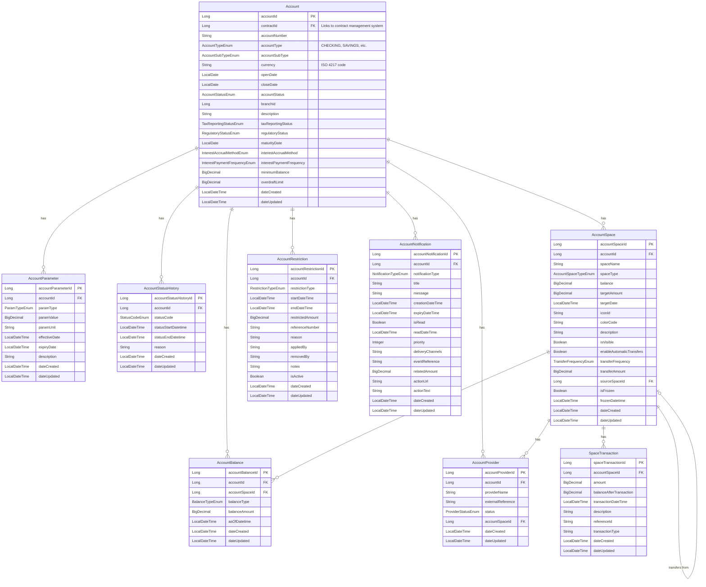

# Core Banking Accounts Service

## Overview

The Core Banking Accounts Service is a comprehensive microservice for managing banking accounts and related operations. It provides a robust API for creating, updating, and managing bank accounts, account balances, account parameters, account providers, account spaces, and account restrictions.

This service is built with a reactive architecture using Spring WebFlux and R2DBC for non-blocking database operations, making it highly scalable and efficient for handling a large number of concurrent requests.

The service is designed to handle all types of accounts (deposit, current, investment, etc.) through a flexible account type system. Account ownership is managed by an external contract management system via contractId, allowing this service to focus solely on account management.

## Quick Start

### Prerequisites

- Java 21 or higher
- Maven 3.8 or higher
- PostgreSQL 14 or higher
- Docker (optional, for containerized deployment)

### Environment Setup

Set the following environment variables:

```
DB_HOST=localhost
DB_PORT=5432
DB_NAME=accounts_db
DB_USERNAME=postgres
DB_PASSWORD=postgres
DB_SSL_MODE=disable
```

### Build and Run

```bash
# Clone the repository
git clone https://github.com/firefly-oss/core-banking-accounts.git
cd core-banking-accounts

# Build the application
mvn clean install

# Run with Maven
mvn spring-boot:run -pl core-banking-accounts-web

# Or run the JAR file
java -jar core-banking-accounts-web/target/core-banking-accounts-web-1.0.0-SNAPSHOT.jar

# Or run with Docker
docker build -t core-banking-accounts .
docker run -p 8080:8080 --env-file .env core-banking-accounts
```

### Verify Installation

Access the Swagger UI to explore and test the API:

```
http://localhost:8080/swagger-ui.html
```

## Architecture

The service follows a modular architecture with clear separation of concerns:

### Module Structure

- **core-banking-accounts-interfaces**: Contains DTOs, interfaces, and enums that define the API contracts
- **core-banking-accounts-models**: Contains database entities and repositories
- **core-banking-accounts-core**: Contains business logic, services, and mappers
- **core-banking-accounts-web**: Contains REST controllers and application configuration

### Component Interaction

1. **Web Layer**: REST controllers in the web module receive HTTP requests and delegate to services
2. **Service Layer**: Services in the core module implement business logic and use repositories for data access
3. **Data Access Layer**: Repositories in the models module provide access to the database
4. **Interface Layer**: DTOs and interfaces define the API contracts between layers

### Technology Stack

- **Java 21**: Utilizing the latest Java features including virtual threads
- **Spring Boot**: Application framework
- **Spring WebFlux**: Reactive web framework
- **R2DBC**: Reactive database connectivity
- **PostgreSQL**: Database for persistent storage
- **Flyway**: Database migration tool
- **Swagger/OpenAPI**: API documentation
- **Maven**: Build and dependency management

## Data Model

The following diagram shows the relationships between the main entities in the system:



### Key Entities

- **Account**: The core entity representing a banking account
  - Uses `AccountTypeEnum` to support various account types (CHECKING, SAVINGS, TERM_DEPOSIT, LOAN, CREDIT_CARD, INVESTMENT, MORTGAGE, etc.)
  - Uses `AccountSubTypeEnum` for more granular classification
- **AccountBalance**: Tracks different types of balances for accounts and spaces
- **AccountParameter**: Stores configurable parameters with effective dates
- **AccountProvider**: Manages connections to external banking providers
- **AccountStatusHistory**: Tracks the history of account status changes
- **AccountSpace**: Represents spaces or buckets within an account for organizing money
- **SpaceTransaction**: Tracks transaction history for account spaces
- **AccountRestriction**: Represents restrictions or holds placed on an account
- **AccountNotification**: Represents notifications or alerts for an account

### Business Rules

- Each account must have at least one MAIN space
- Spaces can have their own balance, but the sum of all space balances must equal the account's total balance
- Spaces can have their own transaction history
- Parameters can have different values for different time periods
- Every status change must be recorded with start and end dates
- Each account can have multiple providers
- Balance amounts are stored with 4 decimal places for high precision
- Space transactions affect the space balance and are recorded with a timestamp
- Account ownership is managed by the external contract management system via contractId
- Account types are defined using enums for type safety and consistency

## API Documentation

The service provides a comprehensive API for managing all aspects of banking accounts:

### Core Account Endpoints

- `/api/v1/accounts`: Account management endpoints
- `/api/v1/accounts/{accountId}/balances`: Account balance endpoints
- `/api/v1/account-parameters`: Account parameter endpoints
- `/api/v1/account-providers`: Account provider endpoints
- `/api/v1/account-status-history`: Account status history endpoints

### Account Space Endpoints

- `/api/v1/account-spaces`: Account space management endpoints
  - `GET /`: List all account spaces with filtering
  - `POST /`: Create a new account space
  - `GET /{accountSpaceId}`: Get an account space by ID
  - `PUT /{accountSpaceId}`: Update an account space
  - `DELETE /{accountSpaceId}`: Delete an account space
  - `GET /account/{accountId}`: Get all spaces for an account
  - `POST /{sourceSpaceId}/transfer/{targetSpaceId}`: Transfer between spaces
  - `GET /{accountSpaceId}/goal-progress`: Calculate goal progress
  - `POST /{accountSpaceId}/configure-automatic-transfers`: Configure automatic transfers

- `/api/v1/account-spaces/{accountSpaceId}/transactions`: Account space transaction endpoints
  - `POST /`: Record a new transaction for an account space
  - `GET /`: Get all transactions for an account space
  - `GET /filter/date`: Get transactions within a date range
  - `GET /analytics/deposits`: Calculate total deposits for a date range
  - `GET /analytics/withdrawals`: Calculate total withdrawals for a date range
  - `GET /history/balance`: Get the balance at a specific point in time

### Account Restrictions Endpoints

#### Account Restrictions API
- `GET /api/v1/account-restrictions`: Filter account restrictions
- `POST /api/v1/account-restrictions`: Create a new account restriction
- `GET /api/v1/account-restrictions/{accountRestrictionId}`: Get an account restriction by ID
- `PUT /api/v1/account-restrictions/{accountRestrictionId}`: Update an account restriction
- `DELETE /api/v1/account-restrictions/{accountRestrictionId}`: Delete an account restriction
- `GET /api/v1/account-restrictions/account/{accountId}`: Get all restrictions for an account
- `GET /api/v1/account-restrictions/account/{accountId}/active`: Get active restrictions for an account
- `POST /api/v1/account-restrictions/{accountRestrictionId}/remove`: Remove a restriction

### Account Notifications API
- `GET /api/v1/account-notifications`: Filter account notifications
- `POST /api/v1/account-notifications`: Create a new account notification
- `GET /api/v1/account-notifications/{accountNotificationId}`: Get an account notification by ID
- `PUT /api/v1/account-notifications/{accountNotificationId}`: Update an account notification
- `DELETE /api/v1/account-notifications/{accountNotificationId}`: Delete an account notification
- `GET /api/v1/account-notifications/account/{accountId}`: Get all notifications for an account
- `GET /api/v1/account-notifications/account/{accountId}/unread`: Get unread notifications for an account
- `GET /api/v1/account-notifications/account/{accountId}/type/{notificationType}`: Get notifications by type
- `POST /api/v1/account-notifications/{accountNotificationId}/mark-read`: Mark a notification as read
- `POST /api/v1/account-notifications/account/{accountId}/mark-all-read`: Mark all notifications as read
- `GET /api/v1/account-notifications/account/{accountId}/active`: Get active notifications for an account

For detailed API documentation, access the Swagger UI when running the application:

```
http://localhost:8080/swagger-ui.html
```

The Swagger UI provides comprehensive documentation for all endpoints, including:

- **Account Management**: Create, read, update, and delete accounts
- **Account Space Management**: Create and manage spaces within accounts
- **Account Space Transactions**: Record and retrieve transaction history for spaces

- **Balance Management**: Track and update balances for accounts and spaces
- **Parameter Management**: Configure and manage account parameters
- **Provider Integration**: Connect accounts to external banking providers
- **Status History**: Track the history of account status changes
- **Restrictions**: Apply and manage restrictions on accounts
- **Notifications**: Configure and manage account notifications

Each API endpoint is documented with:

- **Detailed Markdown Descriptions**: Comprehensive explanations of each endpoint's purpose and functionality
- **Business Rules**: Important rules and constraints that apply to the operation
- **Request Parameters**: All parameters with descriptions, data types, and whether they're required
- **Response Schemas**: Detailed structure of response objects
- **Status Codes**: All possible response codes with explanations
- **Example Requests**: Sample requests to help with implementation

The API follows RESTful design principles with resource-oriented URLs and appropriate HTTP methods:

- **Resource-Oriented URLs**: Endpoints are organized around resources (e.g., `/accounts/{accountId}/spaces/{accountSpaceId}`)
- **HTTP Methods**: Using appropriate methods for operations (GET for retrieval, POST for creation, etc.)
- **Hierarchical Structure**: Resources are organized in a logical hierarchy (e.g., spaces belong to accounts)
- **Consistent Naming**: Consistent naming conventions across all endpoints
- **Filtering and Pagination**: Support for filtering, sorting, and pagination on collection resources
- **Hypermedia Links**: Where appropriate, responses include links to related resources

### API Examples by Flow

Below are examples of common workflows and how to use the API to accomplish them:

#### 1. Account Creation and Management Flow

This flow demonstrates how to create and manage a bank account.

##### Step 1: Create a new account

```bash
# Request
curl -X POST http://localhost:8080/api/v1/accounts \
  -H "Content-Type: application/json" \
  -d '{
    "contractId": 500123,
    "accountNumber": "2024-00001-001",
    "accountType": "CHECKING",
    "currency": "EUR",
    "openDate": "2024-01-15",
    "accountStatus": "OPEN",
    "branchId": 1001,
    "description": "Primary checking account"
  }'

# Response (201 Created)
{
  "accountId": 100001,
  "contractId": 500123,
  "accountNumber": "2024-00001-001",
  "accountType": "CHECKING",
  "currency": "EUR",
  "openDate": "2024-01-15",
  "closeDate": null,
  "accountStatus": "OPEN",
  "branchId": 1001,
  "description": "Primary checking account",
  "dateCreated": "15/01/2024T10:30:00.000000",
  "dateUpdated": "15/01/2024T10:30:00.000000"
}
```

##### Step 2: Retrieve account details

```bash
# Request
curl -X GET http://localhost:8080/api/v1/accounts/100001

# Response (200 OK)
{
  "accountId": 100001,
  "contractId": 500123,
  "accountNumber": "2024-00001-001",
  "accountType": "CHECKING",
  "currency": "EUR",
  "openDate": "2024-01-15",
  "closeDate": null,
  "accountStatus": "OPEN",
  "branchId": 1001,
  "description": "Primary checking account",
  "dateCreated": "15/01/2024T10:30:00.000000",
  "dateUpdated": "15/01/2024T10:30:00.000000"
}
```

##### Step 3: Update account information

```bash
# Request
curl -X PUT http://localhost:8080/api/v1/accounts/100001 \
  -H "Content-Type: application/json" \
  -d '{
    "contractId": 500123,
    "accountNumber": "2024-00001-001",
    "accountType": "CHECKING",
    "currency": "EUR",
    "openDate": "2024-01-15",
    "accountStatus": "OPEN",
    "branchId": 1001,
    "description": "Primary checking account - VIP Customer"
  }'

# Response (200 OK)
{
  "accountId": 100001,
  "contractId": 500123,
  "accountNumber": "2024-00001-001",
  "accountType": "CHECKING",
  "currency": "EUR",
  "openDate": "2024-01-15",
  "closeDate": null,
  "accountStatus": "OPEN",
  "branchId": 1001,
  "description": "Primary checking account - VIP Customer",
  "dateCreated": "15/01/2024T10:30:00.000000",
  "dateUpdated": "15/01/2024T10:45:00.000000"
}
```

#### 2. Account Space Management Flow

This flow demonstrates how to create and manage spaces within an account, including transaction history and space-specific statements.

##### Step 1: Create the main account space

```bash
# Request
curl -X POST http://localhost:8080/api/v1/account-spaces \
  -H "Content-Type: application/json" \
  -d '{
    "accountId": 100001,
    "spaceName": "Main Account",
    "spaceType": "MAIN",
    "balance": 1000.00,
    "isVisible": true,
    "description": "Primary space for daily transactions"
  }'

# Response (201 Created)
{
  "accountSpaceId": 1000001,
  "accountId": 100001,
  "spaceName": "Main Account",
  "spaceType": "MAIN",
  "balance": 1000.0000,
  "targetAmount": null,
  "targetDate": null,
  "iconId": null,
  "colorCode": null,
  "description": "Primary space for daily transactions",
  "isVisible": true,
  "enableAutomaticTransfers": false,
  "transferFrequency": null,
  "transferAmount": null,
  "sourceSpaceId": null,
  "dateCreated": "15/01/2024T11:00:00.000000",
  "dateUpdated": "15/01/2024T11:00:00.000000"
}
```

##### Step 2: Create a savings goal space

```bash
# Request
curl -X POST http://localhost:8080/api/v1/account-spaces \
  -H "Content-Type: application/json" \
  -d '{
    "accountId": 100001,
    "spaceName": "Vacation Fund",
    "spaceType": "VACATION",
    "balance": 0.00,
    "targetAmount": 2000.00,
    "targetDate": "2024-06-30T00:00:00",
    "iconId": "vacation_icon",
    "colorCode": "#FF5733",
    "isVisible": true,
    "description": "Saving for summer vacation in Italy"
  }'

# Response (201 Created)
{
  "accountSpaceId": 1000002,
  "accountId": 100001,
  "spaceName": "Vacation Fund",
  "spaceType": "VACATION",
  "balance": 0.0000,
  "targetAmount": 2000.0000,
  "targetDate": "2024-06-30T00:00:00.000000",
  "iconId": "vacation_icon",
  "colorCode": "#FF5733",
  "description": "Saving for summer vacation in Italy",
  "isVisible": true,
  "enableAutomaticTransfers": false,
  "transferFrequency": null,
  "transferAmount": null,
  "sourceSpaceId": null,
  "dateCreated": "15/01/2024T11:15:00.000000",
  "dateUpdated": "15/01/2024T11:15:00.000000"
}
```

##### Step 3: Transfer money between spaces

```bash
# Request
curl -X POST "http://localhost:8080/api/v1/account-spaces/transfer?fromAccountSpaceId=1000001&toAccountSpaceId=1000002&amount=200.00"

# Response (200 OK)
true
```

##### Step 4: Configure automatic transfers

```bash
# Request
curl -X POST "http://localhost:8080/api/v1/account-spaces/1000002/automatic-transfers?enabled=true&frequency=MONTHLY&amount=100.00&sourceSpaceId=1000001"

# Response (200 OK)
{
  "accountSpaceId": 1000002,
  "accountId": 100001,
  "spaceName": "Vacation Fund",
  "spaceType": "VACATION",
  "balance": 200.0000,
  "targetAmount": 2000.0000,
  "targetDate": "2024-06-30T00:00:00.000000",
  "iconId": "vacation_icon",
  "colorCode": "#FF5733",
  "description": "Saving for summer vacation in Italy",
  "isVisible": true,
  "enableAutomaticTransfers": true,
  "transferFrequency": "MONTHLY",
  "transferAmount": 100.0000,
  "sourceSpaceId": 1000001,
  "dateCreated": "15/01/2024T11:15:00.000000",
  "dateUpdated": "15/01/2024T11:30:00.000000"
}
```

##### Step 5: Record a transaction for a space

```bash
# Request
curl -X POST "http://localhost:8080/api/v1/account-spaces/1000002/transactions?amount=50.00&description=Monthly%20deposit&referenceId=TXN-123456"

# Response (201 Created)
{
  "spaceTransactionId": 1000001,
  "accountSpaceId": 1000002,
  "amount": 50.0000,
  "balanceAfterTransaction": 250.0000,
  "transactionDateTime": "2024-01-15T12:00:00.000000",
  "description": "Monthly deposit",
  "referenceId": "TXN-123456",
  "transactionType": "DEPOSIT",
  "spaceName": "Vacation Fund",
  "accountId": 100001,
  "dateCreated": "15/01/2024T12:00:00.000000",
  "dateUpdated": "15/01/2024T12:00:00.000000"
}
```

##### Step 6: Get transaction history for a space

```bash
# Request
curl -X GET "http://localhost:8080/api/v1/account-spaces/1000002/transactions?page=0&size=10"

# Response (200 OK)
{
  "content": [
    {
      "spaceTransactionId": 1000001,
      "accountSpaceId": 1000002,
      "amount": 50.0000,
      "balanceAfterTransaction": 250.0000,
      "transactionDateTime": "2024-01-15T12:00:00.000000",
      "description": "Monthly deposit",
      "referenceId": "TXN-123456",
      "transactionType": "DEPOSIT",
      "spaceName": "Vacation Fund",
      "accountId": 100001,
      "dateCreated": "15/01/2024T12:00:00.000000",
      "dateUpdated": "15/01/2024T12:00:00.000000"
    }
  ],
  "page": 0,
  "size": 10,
  "totalElements": 1,
  "totalPages": 1
}
```

##### Step 6.1: Get transactions by date range

```bash
# Request
curl -X GET "http://localhost:8080/api/v1/account-spaces/1000002/transactions/filter/date?startDate=2024-01-01T00:00:00&endDate=2024-01-31T23:59:59&page=0&size=10"

# Response (200 OK)
{
  "content": [
    {
      "spaceTransactionId": 1000001,
      "accountSpaceId": 1000002,
      "amount": 50.0000,
      "balanceAfterTransaction": 250.0000,
      "transactionDateTime": "2024-01-15T12:00:00.000000",
      "description": "Monthly deposit",
      "referenceId": "TXN-123456",
      "transactionType": "DEPOSIT",
      "spaceName": "Vacation Fund",
      "accountId": 100001,
      "dateCreated": "15/01/2024T12:00:00.000000",
      "dateUpdated": "15/01/2024T12:00:00.000000"
    }
  ],
  "page": 0,
  "size": 10,
  "totalElements": 1,
  "totalPages": 1
}
```

##### Step 6.2: Get transaction analytics

```bash
# Request - Calculate total deposits
curl -X GET "http://localhost:8080/api/v1/account-spaces/1000002/transactions/analytics/deposits?startDate=2024-01-01T00:00:00&endDate=2024-01-31T23:59:59"

# Response (200 OK)
250.00

# Request - Calculate total withdrawals
curl -X GET "http://localhost:8080/api/v1/account-spaces/1000002/transactions/analytics/withdrawals?startDate=2024-01-01T00:00:00&endDate=2024-01-31T23:59:59"

# Response (200 OK)
0.00

# Request - Get historical balance
curl -X GET "http://localhost:8080/api/v1/account-spaces/1000002/transactions/history/balance?dateTime=2024-01-10T00:00:00"

# Response (200 OK)
200.00
```

##### Step 7: Check goal progress

```bash
# Request
curl -X GET http://localhost:8080/api/v1/account-spaces/1000002/goal-progress

# Response (200 OK)
{
  "accountSpaceId": 1000002,
  "accountId": 100001,
  "spaceName": "Vacation Fund",
  "spaceType": "VACATION",
  "balance": 250.0000,
  "targetAmount": 2000.0000,
  "targetDate": "2024-06-30T00:00:00.000000",
  "iconId": "vacation_icon",
  "colorCode": "#FF5733",
  "description": "Saving for summer vacation in Italy",
  "isVisible": true,
  "enableAutomaticTransfers": true,
  "transferFrequency": "MONTHLY",
  "transferAmount": 100.0000,
  "sourceSpaceId": 1000001,
  "dateCreated": "15/01/2024T11:15:00.000000",
  "dateUpdated": "15/01/2024T11:30:00.000000",
  "progressPercentage": 12.5,
  "remainingAmount": 1750.0000,
  "estimatedCompletionDate": "2024-07-10T00:00:00.000000",
  "onTrack": false
}
```

#### 3. Balance Operations Flow

This flow demonstrates how to manage account balances.

##### Step 1: Create an initial balance record

```bash
# Request
curl -X POST http://localhost:8080/api/v1/accounts/100001/balances \
  -H "Content-Type: application/json" \
  -d '{
    "balanceType": "CURRENT",
    "balanceAmount": 1000.00,
    "asOfDatetime": "2024-01-15T11:00:00"
  }'

# Response (201 Created)
{
  "accountBalanceId": 1000001,
  "accountId": 100001,
  "accountSpaceId": null,
  "balanceType": "CURRENT",
  "balanceAmount": 1000.0000,
  "asOfDatetime": "2024-01-15T11:00:00.000000",
  "dateCreated": "15/01/2024T11:00:00.000000",
  "dateUpdated": "15/01/2024T11:00:00.000000"
}
```

##### Step 2: Create a balance record for a specific space

```bash
# Request
curl -X POST http://localhost:8080/api/v1/accounts/100001/balances \
  -H "Content-Type: application/json" \
  -d '{
    "accountSpaceId": 1000002,
    "balanceType": "CURRENT",
    "balanceAmount": 200.00,
    "asOfDatetime": "2024-01-15T11:30:00"
  }'

# Response (201 Created)
{
  "accountBalanceId": 1000002,
  "accountId": 100001,
  "accountSpaceId": 1000002,
  "balanceType": "CURRENT",
  "balanceAmount": 200.0000,
  "asOfDatetime": "2024-01-15T11:30:00.000000",
  "dateCreated": "15/01/2024T11:30:00.000000",
  "dateUpdated": "15/01/2024T11:30:00.000000"
}
```

##### Step 3: Retrieve all balances for an account

```bash
# Request
curl -X GET "http://localhost:8080/api/v1/accounts/100001/balances?page=0&size=10"

# Response (200 OK)
{
  "content": [
    {
      "accountBalanceId": 1000001,
      "accountId": 100001,
      "accountSpaceId": null,
      "balanceType": "CURRENT",
      "balanceAmount": 1000.0000,
      "asOfDatetime": "2024-01-15T11:00:00.000000",
      "dateCreated": "15/01/2024T11:00:00.000000",
      "dateUpdated": "15/01/2024T11:00:00.000000"
    },
    {
      "accountBalanceId": 1000002,
      "accountId": 100001,
      "accountSpaceId": 1000002,
      "balanceType": "CURRENT",
      "balanceAmount": 200.0000,
      "asOfDatetime": "2024-01-15T11:30:00.000000",
      "dateCreated": "15/01/2024T11:30:00.000000",
      "dateUpdated": "15/01/2024T11:30:00.000000"
    }
  ],
  "page": 0,
  "size": 10,
  "totalElements": 2,
  "totalPages": 1
}
```

#### 4. Provider Integration Flow

This flow demonstrates how to connect accounts to external providers.

##### Step 1: Connect an account to a provider

```bash
# Request
curl -X POST http://localhost:8080/api/v1/account-providers \
  -H "Content-Type: application/json" \
  -d '{
    "accountId": 100001,
    "providerName": "ClearBank",
    "externalReference": "CB-ACC-123456",
    "status": "ACTIVE"
  }'

# Response (201 Created)
{
  "accountProviderId": 1000001,
  "accountId": 100001,
  "providerName": "ClearBank",
  "externalReference": "CB-ACC-123456",
  "status": "ACTIVE",
  "accountSpaceId": null,
  "dateCreated": "15/01/2024T12:00:00.000000",
  "dateUpdated": "15/01/2024T12:00:00.000000"
}
```

##### Step 2: Connect a specific space to a provider

```bash
# Request
curl -X POST http://localhost:8080/api/v1/account-providers \
  -H "Content-Type: application/json" \
  -d '{
    "accountId": 100001,
    "accountSpaceId": 1000002,
    "providerName": "Modulr",
    "externalReference": "MOD-ACC-001",
    "status": "ACTIVE"
  }'

# Response (201 Created)
{
  "accountProviderId": 1000002,
  "accountId": 100001,
  "providerName": "Modulr",
  "externalReference": "MOD-ACC-001",
  "status": "ACTIVE",
  "accountSpaceId": 1000002,
  "dateCreated": "15/01/2024T12:15:00.000000",
  "dateUpdated": "15/01/2024T12:15:00.000000"
}
```

##### Step 3: Update provider status

```bash
# Request
curl -X PUT http://localhost:8080/api/v1/account-providers/1000001 \
  -H "Content-Type: application/json" \
  -d '{
    "accountId": 100001,
    "providerName": "ClearBank",
    "externalReference": "CB-ACC-123456",
    "status": "SUSPENDED"
  }'

# Response (200 OK)
{
  "accountProviderId": 1000001,
  "accountId": 100001,
  "providerName": "ClearBank",
  "externalReference": "CB-ACC-123456",
  "status": "SUSPENDED",
  "accountSpaceId": null,
  "dateCreated": "15/01/2024T12:00:00.000000",
  "dateUpdated": "15/01/2024T12:30:00.000000"
}
```


## Configuration Profiles

The application supports multiple configuration profiles:

- **dev**: Development environment with detailed logging
- **testing**: Testing environment with API documentation enabled
- **prod**: Production environment with minimal logging and disabled API documentation

## Monitoring and Health Checks

The service exposes the following endpoints for monitoring:

- `/actuator/health`: Health check endpoint
- `/actuator/info`: Application information
- `/actuator/prometheus`: Metrics for Prometheus

## Development Guidelines

### Code Structure

- Follow the package structure based on domain concepts
- Keep controllers thin, with business logic in service classes
- Use DTOs for API contracts and entities for database models
- Use mappers to convert between DTOs and entities

### Testing

- Write unit tests for services and mappers
- Write integration tests for repositories
- Write API tests for controllers

### Database Migrations

Database migrations are managed with Flyway. Migration scripts are located in:

```
core-banking-accounts-models/src/main/resources/db/migration
```

To add a new migration, create a new SQL file with the naming convention `V{number}__{description}.sql`.

## Contributing

Please read the [CONTRIBUTING.md](CONTRIBUTING.md) file for details on our code of conduct and the process for submitting pull requests.

## License

This project is licensed under the [LICENSE](LICENSE) file for details.
